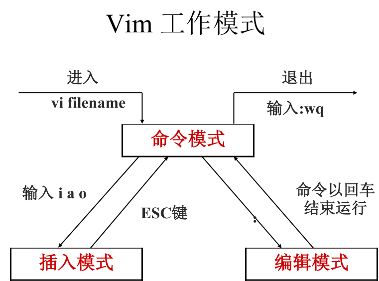

### 安装虚拟机

### 系统分区

### 远程登录

- 远程登录管理工具 : WinSCP  secureCRT
- ifconfig eth0 ipadress

### 给初学者的建议

- Linux的各个目录的作用
- 远程服务器不允许关机，只能重启
- 重启时应该关闭服务
- 不要在服务器访问高峰运行高负载命令
- 远程配置防火墙时不要把自己踢出服务器
- 指定合理的密码规范并定期更新
- 合理分配权限
- 定期备份重要数据和日志

### Linux常用命令

- 文件处理命令

  1. -alh  路径      查看路径下的文件      ls -i 查看i节点   ls -ld 只看当前目录并不展开

  2. "-rwxrwxrwx"  (-二进制文件 d目录 l软连接文件 )

  3. u g o (u所有者 g所属组 o其他人 r读 w写 x执行)

  4. mkdir -p    新建目录  -p 递归创建目录

  5. cd ..  切换目录

  6. pwd 当前目录

  7. rmdir 删除空目录

  8. cp -rp  源文件或目录  目标目录  -r 只复制  -p 保留文件属性

  9. mv 源文件或目录 目标目录  剪切、改名

  10. rm -rf 文件或目录  -r 删除目录或文件  -f 强制执行

  11. touch 文件名   创建空文件

  12. cat -n 显示文件内容    -n 显示行号

  13. more 文件名   分页显示文件内容  

      1. 空格或f翻页
      2. enter 换行
      3. q或Q 退出

  14. less 文件名 分页显示文件内容  

      1. 与more功能相同
      2. pageup可以向上翻一页，向上箭头可以向上翻一行
      3. 可以搜索  按一个斜杠"/"->输入要搜索的字段->可以按n继续向下查找（next）

  15. head -n 显示文件的前几行  -n 指定行数 ，默认是显示10行

      - head -n 20 /etc/services

  16. tail -n  显示文件后面几行  tail -f 动态显示文件末尾内容

      - tail -n 18 /etc/services

  17. ln -s 原文件 目标文件  生成软连接文件  如果没有-s 则生成硬链接文件

      - ln -s /etc/issue /tmp/issue.soft

      - ln /etc/issue /tmp/issue.hard

      3. 软链接类似windows的快捷方式

        - 权限都是 rwxrwxrwx 开头都是 l
        - 文件大小都是很小的，只是符号链接
        - 箭头指向源文件

      4. 硬链接

         - cp -p + 同步更新

         echo "www.lampbrother.net" >> /etc/issue

         - 源文件删除，硬链接依然能访问
         - 通过i节点识别
         - 不能跨分区

         - 不能针对目录使用

- 权限管理命令

  1. chmod 改变文件或目录权限
     1. chmod [{ugoa}{+-=}{rwx}]/ [ 文件或目录]
        - chmod u+x Japan.list
        - chmod g+w,o-r Japan.list
        - chmod g=rwx Japan.list
     2. chmod [mode=421]/ [文件或目录]    用权限数字形式
        - r --------4
        - w--------2
        - x---------1
        - rwxrw-r--  7  6  4
        - chmod 640 Japan.list
     3. chmod -R 递归修改
        - chmod -R 777 testdir 修改目录testdir及其目录下文件为所有用户具有全部权限
     4. file、dir权限解读
        1. file
           - r:cat/more/head/tail/less
           - w:vim
           - x:script command
        2. dir
           - r:ls
           - w:touch/mkdir/rmdir/rm
           - x:cd
  2. chown 改变文件或目录的所有者
     1. chown 【用户】【文或目录】
     2. chown shenchao fengjie.txt 改变文件fengjie的所有者为shenchao
  3. chgrp 改变文件或目录的所属组
     1. chgrp 【用户组】【文件或目录】
     2. chgrp lampbrother fengjie 改变文件fengjie的所属组为lampbrother
  4. umask shell内置命令
     1. 以rwx形式显示新建文件的缺省权限
     2. 显示、设置文件的缺省权限
     3. umask -S
     4. umask 022

- 文件搜索命令

  1. find命令  文件搜索
     1. find 【搜索范围】【匹配条件】
     2. find /etc -name init
        - 在目录/etc中查找文件init
        - -iname不区分大小写
     3. find / -size +204800
        - 在根目录下查找大100MB的文件
        - +n 大于 -n 小于  n 等于
     4. find /home -user shenchao
        - 在根目录下查找所有者为shenchao的文件
        - -group 根据所属组查找
     5. find /etc -cmin -5
        - 在 /etc 下查找5分钟内被修改过属性的文件和目录
        - -amin 访问时间access
        - -cmin 文件属性change
        - -mmin 文件内容 modify
     6. find /etc -size +163840 -a -size -204800
        - 在/etc下查找大于80MB小于100MB的文件
        - -a 两个条件同时满足
        - -o 两个条件满足任意一个即可
     7. find /etc -name inittab -exec ls -l {} \;
        - 在/etc下查找inittab文件并显示其详细信息
        - -exec/-ok 命令 {} \; 对搜索结果执行操作
        - -type 根据文件类型查找
          f 文件 d 目录 l 软链接文件
        - -inum 根据i节点查找
  2. locate 命令 在文件资料库中查找文件
     - locate inittab
  3. which命令 搜索命令所在目录及别名信息
     - which ls
  4. whereis命令 搜索命令所在目录及帮助文档路径
     - whereis ls
  5. grep命令 在文件中搜寻字串匹配的行并输出
     - -i 不区分大小写
     - -v 排除指定字串
     - grep mysql /root/install.log

- 帮助命令

  1. man命令 获得帮助信息
     - man ls 查看ls命令的帮助信息
     - man services 查看配置文件services的帮助信息
  2. help命令 获得Shell内置命令的帮助信息
     - help umask 查看umask命令的帮助信息

- 用户管理命令

  1. useradd 命令  添加新用户
     - useradd yangmi
     - 执行权限 root
  2. passwd 命令 设置用户密码
     - passwd yangmi
  3. who命令 查看登录用户信息
     - who
  4. w命令 查看登录用户详细信息

- 压缩解压命令

  1. gzip命令 压缩文件  gzip 【文件】 
     - 压缩后  .gz
  2. gunzip命令 解压缩.gz的压缩文件
     - gunzip 【压缩文件】
     - gunzip boduo.gz
  3. tar 命令压缩  打包目录
     - tar 选项【-zcf】【压缩后文件名】【目录】
     - -c 打包
       -v 显示详细信息
       -f 指定文件名
       -z 打包同时压缩
     - 压缩后 .tar.gz
     - tar -zcf Japan.tar.gz Japan 将目录Japan打包并压缩为.tar.gz文件
  4. tar命令解压 
     - -x 解包
       -v 显示详细信息
       -f 指定解压文件
       -z 解压缩
     - $ tar -zxvf Japan.tar.gz
  5. zip命令 压缩文件或目录
     - zip 选项【-r】【压缩后文件名】【文件或目录】
     - -r 压缩目录
     - zip buduo.zip boduo 压缩文件
     - zip -r Japan.zip Japan 压缩目录
  6. unzip 解压.zip的压缩文件
     - unzip [压缩文件]
     - unzip test.zip
  7. bzip2命令 压缩文件
     -  bzip2 选项 【-k】【文件】
     - -k 产生压缩文件后保留原文件
     - 压缩后 .bz2
     - bzip2 -k boduo
     - tar -cjf Japan.tar.bz2 Japan
  8. bunzip2命令 解压缩
     -  bunzip2 选项 【-k】【压缩文件】
     - -k 解压缩后保留原文件
     - bunzip2 -k boduo.bz2
     - tar -xjf Japan.tar.bz2

- 网络命令

  1. write命令 给用户发信息，以Ctrl+D保存结束

     - write <用户名>
     - write lingzhiling

  2. wall命令 发广播信息

     - wall 【massage】
     - wall shenchao is a honest man！

  3. ping命令 测试网络连通性

     - ping 选项 IP地址
     - -c 指定发送次数
     - ping 192.168.1.156

  4. ifconfig 命令 查看和设置网卡信息

     - ifconfig 网卡名称 IP地址
     - 执行权限 root
     - ifconfig eth0 192.168.8.250

  5. mail 命令 查看发送电子邮件

     - mail 【用户名】
     - mail root

  6. last 命令 列出目前与过去登入系统的用户信息

  7. lastlog 检查某特定用户上次登录的时间

     - lastlog
     - lastlog -u 502

  8. traceroute 命令

     - 显示数据包到主机间的路径
     - traceroute www.lampbrother.net

  9. netstat命令 显示网络相关信息

     - netstat [选项]

     - | -t   | ：   | TCP协议            |
       | ---- | ---- | ------------------ |
       | -u   | ：   | UDP协议            |
       | -l   | ：   | 监听               |
       | -r   | ：   | 路由               |
       |      | ：   | 显示IP地址和端口号 |

       范例

       netstat -tlun 查看本机监听的端口

       netstat -an 查看本机所有的网络连接

       netstat -rn 查看本机路由表

  10. setup命令 配置网络

      - 执行权限 root

- 挂载命令

  mount命令 

  - mount [-t 文件系统] 设备文件名 挂载点
  - mount -t iso9660 /dev/sr0 /mnt/cdrom

- 关机重启命令

  1. shutdown命令

     - -c： 取消前一个关机命令
       -h： 关机
       -r： 重启

  2. 其他关机命令

     1. halt
     2. poweroff
     3. init 0

  3. 其他重启命令

     1. reboot
     2. init 6

  4. 系统运行级别

     0  关机
     1 单用户
     2 不完全多用户，不含NFS服务
     3 完全多用户
     4 未分配
     5 图形界面
     6 重启

  5. cat /etc/inittab  修改系统默认运行级别

     - id:3:initdefault:

  6. runlevel  查询系统运行级别

  7. 退出登录命令 logout

### vim

#### 常用命令

Vim 没有菜单，只有命令

​	

- 插入命令

  | 命令 | 作用                 |
  | ---- | -------------------- |
  | a    | 在光标所在字符后插入 |
  | A    | 在光标所在行尾插入   |
  | i    | 在光标所在字符前插入 |
  | I    | 在光标所在行行首插入 |
  | o    | 在光标下插入新行     |
  | O    | 在光标上插入新行     |

- 定位命令

  | 命令       | 作用       |
  | ---------- | ---------- |
  | : set nu   | 设置行号   |
  | : set nonu | 取消行号   |
  | gg         | 到第一行   |
  | G          | 到最后一行 |
  | nG         | 到第n行    |
  | : n        | 到第n行    |
  | $          | 移至行尾   |
  | 0          | 移至行首   |

- 删除命令

  | 命令    | 作用                         |
  | ------- | ---------------------------- |
  | x       | 删除光标所在处字符           |
  | nx      | 删除光标所在处后n个字符      |
  | dd      | 删除光标所在行，ndd删除n行   |
  | dG      | 删除光标所在行到文件末尾内容 |
  | D       | 删除光标所在处到行尾内容     |
  | :n1,n2d | 删除指定范围的行             |

- 复制和剪切命令

  | 命令 | 作用                   |
  | ---- | ---------------------- |
  | yy   | 复制当前行             |
  | nyy  | 复制当前行以下n行      |
  | dd   | 剪切当前行             |
  | ndd  | 剪切当前行以下n行      |
  | p,P  | 粘贴在当前光标所在行下 |

- 替换和取消命令

  | 命令 | 作用                                |
  | ---- | ----------------------------------- |
  | r    | 取代光标所在处字符                  |
  | R    | 从光标所在处开始替换字符，按Esc结束 |
  | u    | 取消上一步操作                      |

- 搜索和搜索替换命令

  | 命令              | 作用                                     |
  | ----------------- | ---------------------------------------- |
  | /string           | 搜索指定字符串，搜索时忽略大小写 :set ic |
  | n                 | 搜索指定字符串的下一个出现位置           |
  | :%s/old/new/g     | 全文替换指定字符串                       |
  | :n1,n2s/old/new/g | 在一定范围内替换指定字符串               |

- 保存和退出命令

  | 命令            | 作用                                     |
  | --------------- | ---------------------------------------- |
  | :w              | 保存修改                                 |
  | :w new_filename | 另存为指定文件                           |
  | :wq             | 保存修改并退出                           |
  | ZZ              | 快捷键，保存修改并退出                   |
  | :q!             | 不保存修改退出                           |
  | :wq!            | 保存修改并退出（文件所有者及root可使用） |

#### 使用技巧

- 导入命令执行结果 :r !命令
- 定义快捷键 :map 快捷键 触发命令
  - 范例： : map ^P I#<ESC>
  - : map ^B 0x
- 连续行注释
  - :n1,n2s/^/#/g
  - :n1,n2s/^#//g
  - :n1,n2s/^/\/\//g
- 替换
  -  :ab mymail samlee@lampbrother.net

### 软件安装

#### 软件包管理

 	1. 软件包分类
     - 源码包  	脚本安装包
     - 二进制包（RPM包、系统默认包）
 	2. 源码包
     - 源码包的优点是：
       - 开源，如果有足够的能力，可以修改源代码
       - 可以自由选择所需的功能
       - 软件是编译安装，所以更加适合自己的系统，更加稳定也效率更高
       - 卸载方便
     - 源码包的缺点：
       - 安装过程步骤较多，尤其安装较大的软件集合时（如LAMP环境搭建），容易出现拼写错误
       - 编译过程时间较长，安装比二进制安装时间长
       - 因为是编译安装，安装过程中一旦报错新手很难解决
	3. RPM包
    - 二进制包的优点
      - 包管理系统简单，只通过几个命令就可以实现包的安装、升级、查询和卸载
      - 安装速度比源码包安装快的多
    - 二进制包缺点：
      - 经过编译，不再可以看到源代码
      - 功能选择不如源码包灵活
      - 依赖性

#### RPM包管理-rpm命令管理

 1.  RPM包命名原则

     httpd-2.2.15-15.el6.centos.1.i686.rpm

     | 字符       | 含义            |
     | ---------- | --------------- |
     | httpd      | 软件包名        |
     | 2.2.15     | 软件版本        |
     | 15         | 软件发布的次数  |
     | el6.centos | 适合的Linux平台 |
     | i686       | 适合的硬件平台  |
     | rpm        | rpm包扩展名     |

 2.  RPM包依赖性

     - 树形依赖： a->b->c
     - 环形依赖： a->b->c->a
     - 模块依赖： 模块依赖查询网站：
       www.rpmfind.net

	3. 包全名与包名

    	1. 包全名：操作的包是没有安装的软件包时，
        使用包全名。而且要注意路径
    	2. 包名：操作已经安装的软件包时，使用包名。是搜索/var/lib/rpm/中的数据库

	4. RPM安装

    - rpm –ivh 包全名

      | 选项          | 含义         |
      | ------------- | ------------ |
      | -i（install） | 安装         |
      | -v（verbose） | 显示详细信息 |
      | -h（hash）    | 显示进度     |
      | --nodeps      | 不检测依赖性 |

	5. RPM包升级

    rpm -Uvh 包全名

    | 选项          | 含义 |
    | ------------- | ---- |
    | -U（upgrade） | 升级 |

	6. 卸载

    rpm -e 包名

    | 选项        | 含义         |
    | ----------- | ------------ |
    | -e（erase） | 卸载         |
    | --nodeps    | 不检查依赖性 |

	7. 查询是否安装

    - rpm -q 包名 # 查询包是否安装

    - rpm –qa      # 查询所有已经安装的 RPM 包

      | 选项        | 含义        |
      | ----------- | ----------- |
      | -e（erase） | 卸载        |
      | -a          | 所有（all） |

	8. 查询软件包详细信息

    - rpm –qi 包名

      | 选项 | 含义                        |
      | ---- | --------------------------- |
      | -i   | 查询软件信息（information） |
      | -p   | 查询未安装包信息（package） |

	9. 查询包中文件安装位置

    - rpm –ql 包名

      | 选项 | 含义                        |
      | ---- | --------------------------- |
      | -l   | 列表（list）                |
      | -p   | 查询未安装包信息（package） |

	10. 查询系统文件属于哪个RPM包

     - rpm –qf 系统文件名

       | 选项 | 含义                               |
       | ---- | ---------------------------------- |
       | -f   | 查询系统文件属于哪个软件包（file） |

	11. 查询软件包的依赖性

     - rpm –qR 包名

       | 选项 | 含义                           |
       | ---- | ------------------------------ |
       | -R   | 查询软件包的依赖性（requires） |
       | -p   | 查询未安装包信息（package）    |

	12. RPM包校验

     - rpm –V 已安装的包名

       | 选项 | 含义                            |
       | ---- | ------------------------------- |
       | -V   | 校验指定RPM包中的文件（verify） |

     验证内容中的8个信息的具体内容如下：

     | 符号 | 含义                                              |
     | ---- | ------------------------------------------------- |
     | S    | 文件大小是否改变                                  |
     | M    | 文件的类型或文件的权限（rwx）是否被改变           |
     | 5    | 文件MD5校验和是否改变（可以看成文件内容是否改变） |
     | D    | 设备的中，从代码是否改变                          |
     | L    | 文件路径是否改变                                  |
     | U    | 文件的属主（所有者）是否改变                      |
     | G    | 文件的属组是否改变                                |
     | T    | 文件的修改时间是否改变                            |

     文件类型

     | 符号 | 含义                                                         |
     | ---- | ------------------------------------------------------------ |
     | c    | 配置文件（config file）                                      |
     | d    | 普通文档（documentation）                                    |
     | g    | “鬼”文件（ghost file），很少见，就是该文件不应该被这个RPM包包含 |
     | l    | 授权文件（license file）                                     |
     | r    | 描述文件（read me）                                          |

	13. RPM包中文件提取

     - rpm2cpio 包全名 | \
     - cpio -idv .文件绝对路径
       - rpm2cpio    # 将 rpm 包转换为 cpio 格式的命令
       - cpio    # 是一个标准工具，它用于创建软件档案文件和从档案文件中提取文件
     - cpio 选项 < [文件|设备]
       - -i：copy-in模式，还原
       - -d：还原时自动新建目录
       - -v：显示还原过程
     - rpm -qf /bin/ls    # 查询 ls 命令属于哪个软件包
     - mv /bin/ls /tmp/   # 造成 ls 命令误删除假象
     - rpm2cpio /mnt/cdrom/Packages/coreutils-8.4-19.el6.i686.rpm | cpio -idv ./bin/ls     # 提取 RPM 包中 ls 命令到当前目录的 /bin/ls 下
     - cp /root/bin/ls /bin/     # 把 ls 命令复制回/bin/ 目录，修复文件丢失

     ​

#### RPM包管理-yum在线管理

 1.  IP地址配置和网络yum源

      1.  IP地址配置

          - setup     #使用setup工具
          - vi /etc/sysconfig/network-scripts/ifcfg-eth0    把ONBOOT=“no” 改为ONBOOT=“yes“    #启动网卡
          - service network restart   #重启网络服务

     	2. 网络yum源

         vi /etc/yum.repos.d/CentOS-Base.repo

         |            |                                                              |
         | ---------- | ------------------------------------------------------------ |
         | [base]     | 容器名称，一定要放在[]中                                     |
         | name       | 容器说明，可以自己随便写                                     |
         | mirrorlist | 镜像站点，这个可以注释掉                                     |
         | baseurl    | 我们的yum源服务器的地址。默认是CentOS官方的yum源服务器，是可以使用的，如果你觉得慢可以改成你喜欢的yum源地址 |
         | enabled    | 此容器是否生效，如果不写或写成enable=1都是生效，写成enable=0就是不生效 |
         | gpgcheck   | 如果是1是指RPM的数字证书生效，如果是0则不生效                |
         | gpgkey     | 数字证书的公钥文件保存位置。不用修改                         |

         ​

 2.  yum命令

      	1. 常用yum命令

     - 查询 
       - yum list   # 查询所有可用软件包列表
       - yum search 关键字   # 搜索服务器上所有和关键字相关的包
     - 安装
       - yum –y install 包名
         - install 安装
         - -y 自动回答yes
     - 升级
       - yum -y update 包名
         - update 升级
         - -y 自动回答yes
     - 卸载
       - yum -y remove 包名
         - remove 卸载
         - -y 自动回答yes

     2.YUM软件组管理命令

     - yum grouplist    #列出所有可用的软件组列表
     - yum groupinstall 软件组名     #安装指定软件组，组名可以由grouplist查询出来
     - yum groupremove 软件组名   #卸载指定软件组

 3.  光盘yum源搭建

      	1. 挂载光盘
          - mount /dev/cdrom /mnt/cdrom/
     	2. 让网络yum源文件失效
         	1. cd /etc/yum.repos.d/
         	2. mv CentOS-Base.repo \CentOS-Base.repo.bak
         	3. mv CentOS-Debuginfo.repo \CentOS-Debuginfo.repo.bak
         	4. mv CentOS-Vault.repo \CentOS-Vault.repo.bak
     	3. 修改光盘yum源文件
         - vim CentOS-Media.repo

     > [c6-media]
     > name=CentOS-$releasever - Media
     > baseurl=file:///mnt/cdrom
     >
     > #######         地址为你自己的光盘挂载地址
     >
     > #######         file:///media/cdrom/
     >
     > #######         file:///media/cdrecorder/
     >
     > #######   注释这两个不存在的地址
     >
     > gpgcheck=1
     > enabled=1
     > ####### 把 enabled=0 改为 enabled=1 ，让这个 yum 源配置文件生效
     >
     > gpgkey=file:///etc/pki/rpm-gpg/RPM-GPG-KEY-CentOS-6

#### 源码包管理

1. 源码包和RPM包的区别

   1. 区别

      - 安装之前的区别：概念上的区别
      - 安装之后的区别：安装位置不同

   2. RPM包安装位置

      - 是安装在默认位置中

        | RPM 包默认安装路径 |                            |
        | ------------------ | -------------------------- |
        | /etc/              | 配置文件安装目录           |
        | /usr/bin/          | 可执行的命令安装目录       |
        | /usr/lib/          | 程序所使用的函数库保存位置 |
        | /usr/share/doc/    | 基本的软件使用手册保存位置 |
        | /usr/share/man/    | 帮助文件保存位置           |

   3. 源码包安装位置

      - 安装在指定位置当中，一般是/usr/local/软件名/

   4. 安装位置不同带来的影响

      RPM包安装的服务可以使用系统服务管
      理命令（service）来管理，例如RPM包安
      装的apache的启动方法是：

      -  /etc/rc.d/init.d/httpd start
      - service httpd start

      而源码包安装的服务则不能被服务管理命
      令管理，因为没有安装到默认路径中。所
      以只能用绝对路径进行服务的管理，如：

      -  /usr/local/apache2/bin/apachectl start

2. 源码包安装过程

   1. 安装准备
      - 安装C语言编译器
      - 下载源码包   http://mirror.bit.edu.cn/apache/httpd/
   2. 安装注意事项
      - 源代码保存位置：/usr/local/src/
      - 软件安装位置：/usr/local/
      - 如何确定安装过程报错：
        - 安装过程停止
        - 并出现error、warning或no的提示
   3. 源码包安装过程
      1. 下载源码包
      2. 解压缩下载的源码包
      3. 进入解压缩目录
         - ./configure 软件配置与检查
           - 定义需要的功能选项。
           - 检测系统环境是否符合安装要求。
           - 把定义好的功能选项和检测系统环境的信息都写入Makefile文件，用于后续的编辑。
         - make 编译
           - make clean
         - make install 编译安装
      4. 源码包的卸载
         - 不需要卸载命令，直接删除安装目录即可。不会遗留任何垃圾文件。

#### 脚本安装包与软件包的选择

1. 脚本安装包

   - 脚本安装包并不是独立的软件包类型，常见安装的是源码包。
   - 是人为把安装过程写成了自动安装的脚本，只要执行脚本，定义简单的参数，就可以完成安装。
   - 非常类似于Windows下软件的安装方式。

2. Webmin的作用

   Webmin 是一个基于 Web 的 Linux 系统管
   理界面。您就可以通过图形化的方式设置
   用户帐号、Apache、DNS、文件共享等服
   务。

3. Webmin安装过程

   1. 下载软件  http://sourceforge.net/projects/webadmin/files/webmin/
   2. 解压缩，并进入加压缩目录
   3. 执行安装脚本

